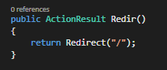
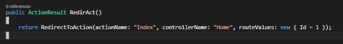

# Redirect 

I can never remember which method to return for an MVC redirect.

* <a href="#redirect">Redirect</a>
* <a href="#redirectPerm">RedirectPermanent</a>
* <a href="#redirectAction">RedirectToAction, RedirectToActionPermanent</a>
* <a href="#redirectRoute">RedirectToRoute, RedirectToRoutePermanent</a>
* <a href="#transfer">Transfer, TransferRequest</a><

The main differences between the base and the *Permantent are the <code>Redirect</code> will return a <a href="https://en.wikipedia.org/wiki/HTTP_302">302 (found)</a>, while the <code>RedirectPermanent</code> will return a <a href="https://en.wikipedia.org/wiki/HTTP_301">301 (Moved Permantently) </a>

## Redirect  

Returns a 302 (Found) to the given url

## Redirect Permanent 

Returns a 301 (Moved Permanently) to the given url

## RedirectToAction, RedirectToActionPermanent 
These work the same as the Redirect(Permanent) methods, but are formed MVC-ish in that you specify the action, controller, and model as you would using the <code>@Url.Action</code> helper method or <code>@Html.ActionLink</code>

## RedirectToRoute, RedirectToRoutePermanent 

These methods allow you to specify the route name (as specified in your RouteConfig.cs and stored in your <a href="https://msdn.microsoft.com/en-us/library/system.web.routing.routetable.routes.aspx">RouteTable</a> ) & values rather than the Action/Controller values.
 

## Transfer, TransferRequest 

These can be used to execute a different url and return the results

<code>Transfer</code> is used in < IIS7 
<code>TransferRequest</code> is used in <a href="http://www.iis.net/learn/application-frameworks/building-and-running-aspnet-applications/how-to-take-advantage-of-the-iis-integrated-pipeline">Integrated Pipeline Mode</a>
    

