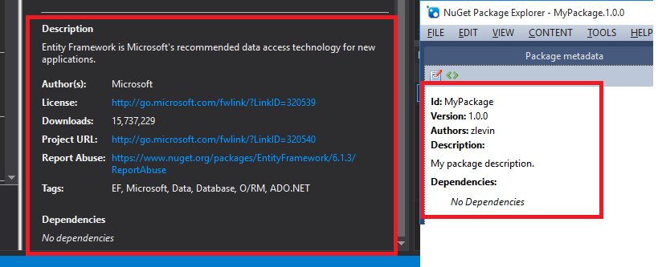

# Nuget

**Problem**: One of the things I work on is Microsoft Dynamics CRM (Customer Relationship Management). This is a web based crm tool made by.... Microsoft. One of the great things about Dynamics CRM is that it provides data access via a very nice sdk. We've got about a dozen different tools & utilities which talk to the CRM database via the SDK. 

    Recently we began the process of upgrading to Dynamics 2016. This invoved a new SDK as well as upgrading our code to use the new early-bound classes. 

    This requires going into each project, removing references to the old sdk, adding references to the new sdk as well as any related framework dependencies. Kind of a pain. 

There is a good bit of ceremony required to get a simple app up and running though. You need to 

1. Add references to the SDK libraries.
2. Add references to the related dependencies.
3. Add an App.config file with the connection string
4. Write the boilerplate context initiation 

**Solution**: This seems like a good use for NuGet. 

The big plusses are that NuGet can help automate these repetitive tasks, as well as keep track of them! Additionaly it will make upgrades easer (and we are currently going through one). We also periodically make changes to the CRM system which alter the early-bound classes. Putting this stuff in a NuGet package source can help with updating when changes are made. 

The first step was to download the (NuGet Package Explorer)[https://npe.codeplex.com/]. This will make learning easier - I tried swinging at this from the command line but I'm impatient. 

Create a new package and fill out all the boring meta-data which is basically the exact same info you see when browsing the package manager. 

 

Next is to add references to the sdk libraries. Because the sdk requires .net 452, they need to be added into the lib\net452\ folder. NuGet package explorer makes this easy with context aware menu's. 

* Choose Content > Add > Lib folder
* Right click on the lib folder and choose add .Net folder > v4.5.2 (if you don't see this, you can choose 4.5.1 and rename the folder)
* Right click on net452 and choose Add Existing File

easy peasy. If you package this up now, it will copy in the proper asemblies. 

Next add the references to the Framework assemblies. This can be done via the drop-down, nothing to add here. 

Next I want to add a class which handles some repetitive tasks like setting up a context for querying the databse. Since we're no longer dealing with references, we can forget about the `lib` folder and create a `content` folder. I'm going to go ahead and add a new cs file to the root of the `content` folder. Right click and add a file called Connection.cs. 

<pre>
using System;
using System.Configuration;
using GNYHA.CRM.Dynamics;
using Microsoft.Xrm.Sdk;
using Microsoft.Xrm.Tooling.Connector;

namespace ????
{
    public static class Connection 
    {
        private static CrmServiceClient ServiceClient
        {
            get 
            {
                return new CrmServiceClient(ConfigurationManager.AppSettings["CrmConnectionString"]);
            }
        }
        
        public static IOrganizationService Service
        {
            get 
            {
                return ServiceClient.OrganizationWebProxyClient ?? (IOrganizationService)ServiceClient.OrganizationServiceProxy;
            }
        }
    }
}
</pre>

The problem is what to use for the namespace. I could leave this un-namespaced but that doesn't seem right. Reading the (documentation)[https://docs.nuget.org/create/configuration-file-and-source-code-transformations] this is a VERY common issue and you can use source code transformations to handle. Just 

1. Rename the file and add .pp to the end
2. Use $rootnamespace$. You can actually use any (Project property)[https://msdn.microsoft.com/en-us/library/vslangproj.projectproperties_properties(VS.80).aspx]. 