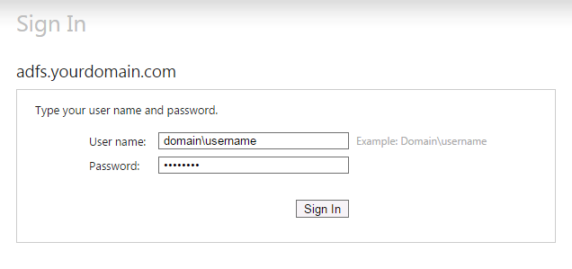
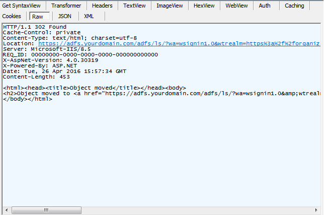
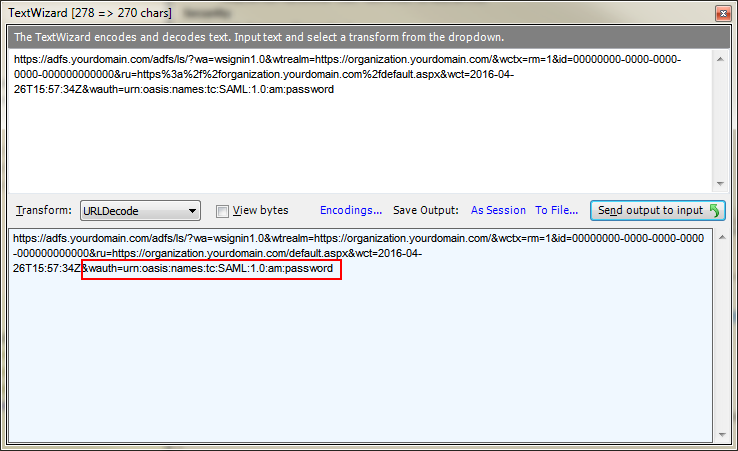
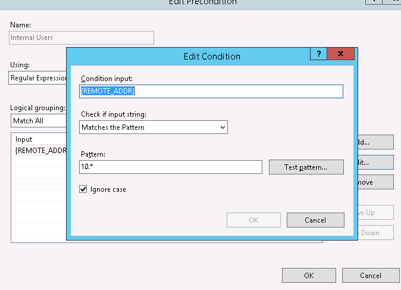
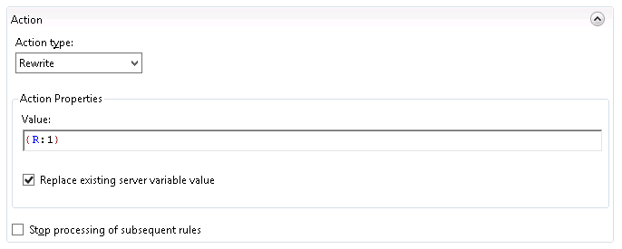

# Using URL Rewrite to fix IFD access

2016-04-26

## Summary

I want to use the IFD url for crm everywhere, but I don't want internal users to hit a login page

## Details 

Microsoft Dynamics has a number of different authentication scenario's for an On-Premise installation. If you want to publish your CRM instance externally, you need to configure your system as an IFD (Internet Facing Deployment). 

The way that it works is that well documented on the microsoft site. The problem that we have is that we are split 80/20 internal vs external crm access. So we really want to optimize the experience for the internal users, but we still want to provide external access. By simply having external access, you have to configure your system as an IFD. 

CRM separates internal vs external traffic based on the url. All IFD access is done via the url https://_organization_.**domain.com**. All interal access is done via the url https://**internalname**/_organization_. 

This presents a problem. We want a single url that we can distribute. This is good both for communication - we can always tell everyone the same thing and it's easier to remember; and practically - if an internal rep sends a link to an external rep - it just works, if you bookmark the site when you're internal, it will still work when you bring your laptop home. 

I think the cleanest url is the IFD. We *could* distribute the external url to everyone, but the issue is that when you hit the external url, even from inside the network, you are greeted by a login page. 

This ain't going to cut it. Some people are in/out of crm all day. 

## Solution - Use Url Rewrite!! 

Using Fiddler, I can see that the first response when I access the external url is a 302 with a Location of our adfs server. 

The location looks encoded, so I use Fiddler's text wizard to decode the output. (It is actually double encoded, so you need to URLDecode, then "Send output to input" and URLDecode again). 

The thing to notice here is the [authentication method is Password](https://msdn.microsoft.com/en-us/library/ee895365.aspx#sectionSection2). This is the user name and password screen. [A list of authentication methods can be found on msdn](https://msdn.microsoft.com/en-us/library/system.identitymodel.tokens.samlauthenticationstatement.authenticationmethod(v=vs.110).aspx). 

It looks like the default is Unspecified and when I try simply removing the wauth parameter, I am logged in - yay! So all we need to do is pull that parameter off of the 302 for internal users. 

### [In comes the IIS Url Rewrite module](http://www.iis.net/downloads/microsoft/url-rewrite) 

The URL Rewrite module is installed by default with Dynamics CRM. It allows you to do powerful transformations on inbound and outbound messages. We can use the URL Rewrite module to a) Detect when a request is on the internal network, and b) rewrite the 302 request to remove the username and password parameter on the adfs redirect. 

To do this, create a new Outbound rule. 

I used a pre-condition so that we are only applying this transformation on local traffic. Our company uses the 10.* network for internal

Then we need to set up the Match. Since we're manipulating one of the headers (Location), switch the matching scope to Server Variable, and set the Variable name to RESPONSE_Location. 

For the matching pattern, i use <code>(https.*)(/*&wauth=urn%3aoasis%3anames%3atc%3aSAML%3a1.0%3aam%3apassword)</code>. This will nicely partition the <code>wauth</code> parameter from the rest of the url. You can see in the screenshot that this gets captured into group {R:1}.
 

Knowing which capture group, you can just plug that into the Action tab using the <code>Rewrite</code> Action type: 

