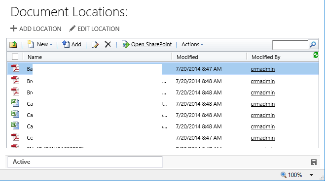
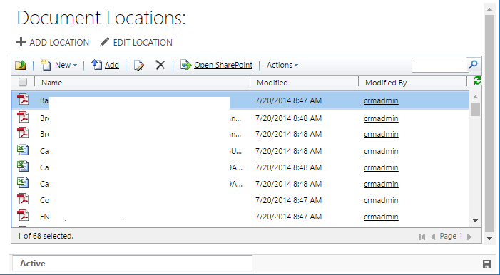
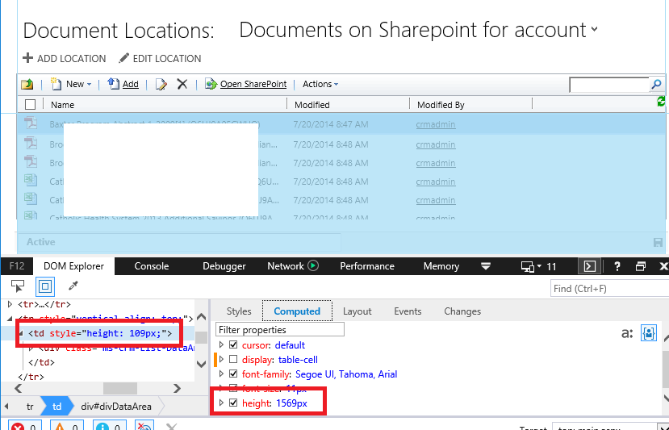
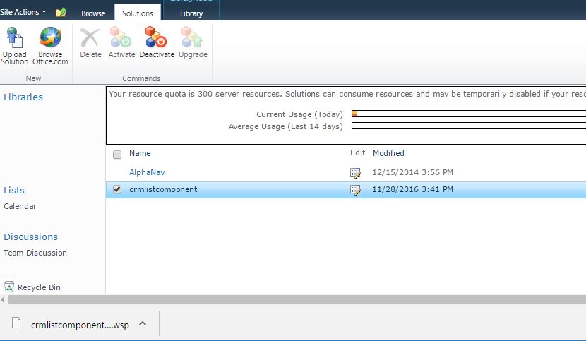

# CRM 2016 - Document list doesn't scroll in IE11

After upgrading to dynamics 2016 and doing a little testing of the sharepoint integration, we noticed a strange bug with the crm list component. 

The crm list component is the skin installed on the sharepoint server which has the proper look and feel to be displayed in crm inside an iframe. The purpose is to allow you to use a full featured document management system without *feeling* like you left the crm system. 

The problem we were seeing is that if the number of documents exceeded the size of the available space, in IE11 the scroll bar  wasn't showing up, and so there really was no way to access the documents which are out of view, and there is no way to get to the paging buttons which are located on the bottom of this frame. 

Oddly, this wasn't the case in crm 2011 - which we upgraded from, and isn't an issue with previous issues of internet explorer. It also works fine in chrome (we don't test Firefox). 

### time to fire up the dev tools

2016-11-30

This was actually a pretty easy issue to spot. If you look at the HTML inspector, you can see that the document list is in a div with `height: 100%`, and that div is in a table cell with a fixed height. The height of this cell changes if you resize the window. 

In IE11 specifically though, if you check the properties of the table cell you can see that the fixed height isn't being respected by the browser. The table cell is actually expanding to the size of its inner content, and so when the div is sized to 100% there is no overflow and nothing to scroll. 

This particular quirk is noted [on stackoverflow.com](http://stackoverflow.com/a/27384730) which essentially states that setting a fixed height on an element with a display mode of table-cell is undefined behavior. Browsers are free to choose how to handle. 

So to fix this we just need to get some CSS on the page which sets the display mode of a table cell with a fixed height to inline-block. Tested this works in dev tools. Since this is in an iframe, the only place this can possible come from is the sharepoint server

To fix - the crmlistcomponent sharepoint library needs to be patched. Luckily, this is for the most part just a packaged group of .net web components - .html, .js, .css, .net libraries etc. 

Login to the sharepoint server as an admin and go to Site Actions > Site Settings > Solution, then download the list component.

 

This downloads as a .wsp file but is actually a cab file - so rename the file to include the .cab extension

Run the EXPAND cl-utility to unpack the cab file

<code><pre>C:\dev\Temp>mkdir crmlistcomponent.wsp

C:\dev\Temp>expand crmlistcomponent.wsp.cab crmlistcomponent.wsp -F:*</pre></code>

Locate the `Layouts\crmgrid.css` file and add a rule at the very bottom which sets the display mode to inline-block. The below uses an attribute selector to apply only to table cell elements which contain a style tag with a fixed height;

<code><pre>#crmGrid td[style*="height"] {
    display: inline-block;
}</pre></code>

Re-pack the .cab file using the cli tool MAKECAB. I ended up using [this powershell snippet](http://stackoverflow.com/a/24668955/972250) to handle the options of packing a whole directory for me. 

Rename the file to remove the .cab extension. (That should leave you with a file called crmlistcomponent.wsp). 

Replace your existing sharepoint crm list component. (Deactivate / upload / activate)

Test!
